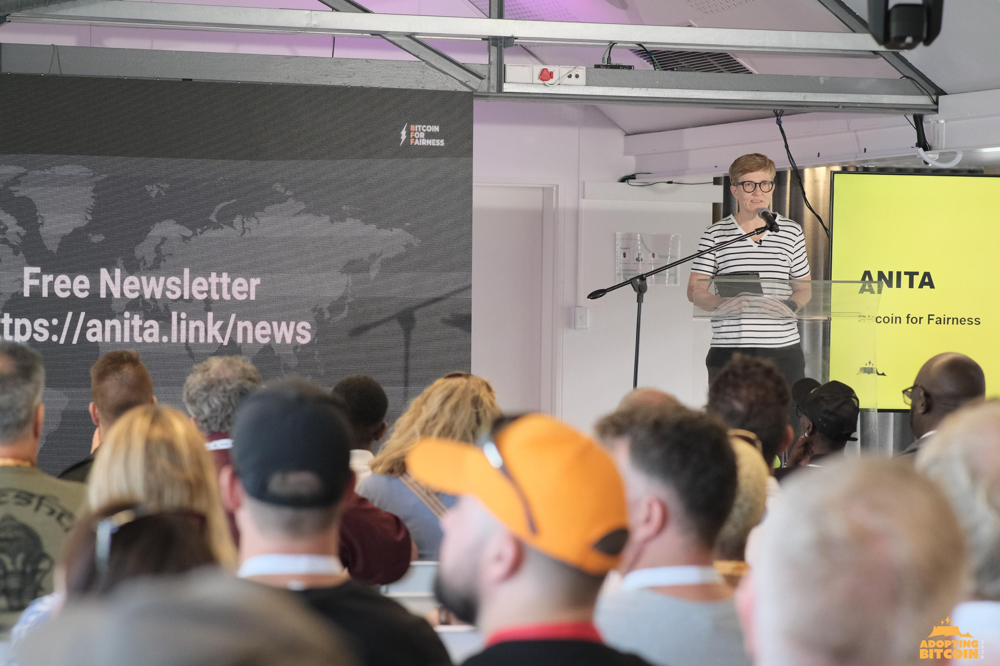

# Opt Out: How Bitcoin and Freedom Tech Build Resilient Systems

## Keynote at Adopting Bitcoin Cape Town 2026

It was the third time I was invited to speak at Adopting Bitcoin Cape Town, and I am really honored to have been part of it again. On the conference website it says: **"As the state's decline leaves critical infrastructure gaps and with growing Bitcoin adoption, this conference is a must-attend to explore how Bitcoin helps people build resilient systems, replacing the failed centralized system."**

In my talk, I addressed why this topic is important for each of us, especially now, and brought examples of how Bitcoin and related technologies are tools to build agency, stability, and bring dignity back into our lives. 

<iframe src="https://player.vimeo.com/video/1168062296?h=c2e68cb0a0&amp;badge=0&amp;autopause=0&amp;player_id=0&amp;app_id=58479" width="846" height="476" frameborder="0" allow="autoplay; fullscreen; picture-in-picture; clipboard-write; encrypted-media; web-share" referrerpolicy="strict-origin-when-cross-origin" title="Bitcoin Is an Exit Strategy (Not Crypto) | Keynote"></iframe>

South Africa, like other African countries, is facing interconnected system failures: power cuts, water shortages, rampant corruption, and massive inequality. While people often blame politicians - and politicians blame other politicians - the main reason for a lot of these problems is the monetary system itself.

## The Flaws of a Debt-Based Monetary System

The monetary system strips wealth from small savers and funnels it to those who already have capital. Debt-based currencies like the Rand, USD, and Euro give cheap credit to people with assets while locking out everyone else. You own nothing? Then you are a liability. You get no credit to build a business, educate your children, or create wealth. 

The system runs on growth, spending, and debt, and it fuels those who already own assets. It's an exclusive club based on permissions. Too poor for a bank account? Sorry. This makes the rich richer and lets them control infrastructure, buy influence, and shape policy through lobbying.

Crony capitalism is an illness of those who can't get enough. No technology can end this. But there is technology that is neutral. Technology anyone can use. Technology from the fringes that enables people on the sidelines to regain agency over their lives, to opt out of a crooked system, and to rebuild their economic power.

Forward-thinking people have opted out already. In places where banking has failed people entirely or in situations where the government fails them, they are already using tools that don't ask for permission. They are building parallel systems that work. Only when people have agency and security can they be resilient in the face of change. Individuals and civil society are building these tools right now. 

## Geopolitics, Power Grabs, and the Need for an Exit Strategy

On January 3rd, 2009, the Bitcoin network went online with the first public block being mined. Coincidentally, on January 3rd of this year, the USA under President Trump went to war against Venezuela to "run the country and make it great again." Just 10 days prior, the USA bombarded parts of Nigeria to "take out ISIS militants and protect Christians." I think these acts were just a demonstration of power: **We can bomb anyone, anywhere.**

Additionally, both Venezuela and Nigeria are rich in oil and natural resources. Trump also stated that American dominance in the Western Hemisphere will never be questioned again. It's the usual interventionism that they sell us in the name of peace to install democracy, when in reality it's an imperialistic power grab financed with our tax money, in our name. In essence, it is enriching the military and financial-industrial complexes and their owners.

So what can we do about this? Do we have agency? It doesn't seem so looking at the big decisions being made: military invasions for resources, corruption, kleptocracy, the amassing of power and capital for private advantage, and the disenfranchisement of and violence against women, people of color, and queer people.

But resistance is possible. Not with state-run money, but with tools like Bitcoin. Held in self-custody, it gives back agency to the people. Unlike state money, where the rulers decide on the rules, your money is at the mercy of banks, and you need permission to spend it, **Bitcoin is rules without rulers** (Andreas M. Antonopoulos).

Bitcoin is an exit strategy, and this is what it was made for - money that can't be taken away from us to finance their wars. Sadly, more and more governments try to stay in power by exercising violence upon their own people. The moral claims that US hegemony is driven by a desire to protect the freedom of all humanity are gone. Now the leaders of the US are honest about their goals to make money for themselves. When we - and I mean mostly Europeans and Americans - boast about how authoritarian many African countries are, we are invited to add the US to that list now.

## Bitcoin vs. Crypto: Know the Difference

Let's remind ourselves of Bitcoin's unique properties. Bitcoin is a **R.I.P.C.O.R.D.** as coined by [Andreas M. Antonopoulos](https://www.youtube.com/aantonop/featured):
* **R**evolutionary
* **I**mmutable
* **P**ublic
* **C**ollaborative
* **O**pen
* **R**esistant to censorship
* **D**ecentralized

Within many definitions, Bitcoin classifies as a cryptocurrency, and Bitcoin laid the groundwork for crypto money. But the thousands of Altcoins that have spread over the years do not adhere to the same strict principles of neutrality and decentralization. 

In the face of Meme-coins like Trumpcoin and Doge, or controlled blockchains like Ripple, Solana, or Cardano, please don't confuse Bitcoin with crypto. Crypto is **C.R.Y.P.T.O.**:
* **C**ontrolled
* **R**ug-pullable
* **Y**ield-obsessed
* **P**ump-and-Dump
* **T**oken-printing
* **O**bsolete

They are neither revolutionary inventions nor permissionless, neutral, or uncensorable. Their existence has been controlled from the very beginning. Pre-mining offered advantages for an exclusive round of investors, while foundations and founders influenced the discourse around technical development and consensus. They are not the "new or better Bitcoin." They are a rip-off made to enrich a few, akin to a scam.

## Freedom Tech in Action: Bitchat and Nostr

Bitcoin's properties are the foundations of new tools that I have been testing in the last months.

### Bypassing Internet Shutdowns with Bitchat
[Bitchat](https://bitchat.free) is an app that uses your phone's Bluetooth to send messages to people nearby. Each phone is a node in a spontaneous network. No centralized server, no mobile data, or cellular services are needed - just a powered phone and Bluetooth. Bitchat is public, collaborative, open, resistant to censorship, and decentralized. 

Why is this important? In March 2025, Zimbabwe's government throttled the internet to suppress protests. I experienced my first internet shutdown while I was there. Luckily, I had a Starlink receiver from Europe, though Zimbabwe-licensed units were likely shut down too. Internet throttling on election days has become common in authoritarian-ruled countries. Under the guise of national security, governments stifle demonstrations and limit free speech.

Uganda faced internet shutdowns during the 2021 elections already. Ahead of a recent election this month, opposition leader Bobi Wine was promoting Bitchat to bypass government control. Following this the Uganda Communications Commission [warned that the government can disable Bitchat](https://nilepost.co.ug/news/312962/don’t-be-excited-by-bitchat,-ucc-boss-warns-ugandans) and after the election the "successful neutralisation" of the Bitchat messaging platform was celebrated. 

However, a technical neutralization can be ruled out with 99% certainty. The government could have infiltrated the network with paid collaborators to control the message, or they might have tried to block app stores, which is likely what they did. But Bitchat is available on alternative platforms like Aurora Store and [GitHub](https://github.com/permissionlesstech/bitchat) too. So their celebrations are very likely just propaganda.

Bitchat's success depends on one thing: how many people download it. Sometime in January, it was the most downloaded app in Uganda. It gets stronger the more people participate, doesn't depend on permission from authorities, and puts power directly in people's hands. It is a fantastic tool also for circular economies and communities with limited cellular networks, enabling communication and saving money on mobile data. I suggest you go to your app store (Android or Apple) and download it. Look for the one with the capital letters "BIT" because there are already rip-offs.

### Reclaiming Content with Nostr
There is another technology that builds on the internet and on Bitcoin's properties, called [Nostr](https://anita.onl/nostr)  (Notes and Other Stuff Transmitted by Relays). It's a new and open protocol. Imagine a new life form on the internet that lives on decentralized computers (relays) that anyone can run without permission. 

It's censorship-resistant: no one can keep you from expressing your opinion or change or delete what you wrote. You don't have to upload your ID. No one can block or freeze your account, as there are no accounts on Nostr. Ownership of your data is secured by cryptographic keys. That means all the content you create belongs to you. 

You can use any Nostr app, for instance, Amethyst on Android or Nostur on iOS, and you can decide what you want to see in your feed, as there is no algorithm. If there were, you could just switch to another app with all your content. You are not at the mercy of Big Tech where you have to play by their rules. You make your own rules. 

If this sounds familiar, these are Bitcoin's foundations. Nostr is for content what Bitcoin is for value. Bitcoin doesn't need Nostr, and Nostr doesn't need Bitcoin, but they work brilliantly together. You can send "Zaps" - Bitcoin micropayments - directly to content creators in seconds. Bitcoin and Nostr are the Swiss Army knife of financial expression and free speech. Tools that give agency back to people, tools that enable civil society to uphold their important function of being a check on power.

## Embracing AI Without Sacrificing Privacy

That leads me to another set of tools to rebuild agency and ownership: Artificial Intelligence. A misnomer from the start, as the machines are not intelligent in the human sense; they are just calculating probabilities. 

AI is already changing the way we work. It will enable anyone to code from websites to wallets. Soon you will be able to custom build your own Bitcoin wallet. Because of privacy concerns, I had been reluctant to use Large Language Models (LLMs). I started experimenting in 2023 because I realized this is going to come either way, and I can make use of it or be left behind.

I started with ChatGPT as everyone does, but soon stopped using it for political and privacy reasons. Sam Altman, founder of OpenAI, is also a co-founder of Worldcoin. Worldcoin is a cryptocurrency that requires individuals to scan their iris to identify themselves. They have been rolling out their product aggressively on the African continent by paying anyone who signed up $25 in exchange for their biometric data and their soul. In Kenya, Worldcoin became the subject of a 2025 [court case and was rightfully instructed to delete all data](https://siliconafrica.org/high-court-instructs-worldcoin-to-delete-the-biometric-data-of-kenyan-citizens/). I don't want to share my data with companies showing no regard for dignity and privacy and taking advantage of unequal bargaining situations.

So **no ChatGPT for me**. Claude was the first tool I used on a regular basis. Since I understood that if you use the free plan on ChatGPT, your conversations might end up in Google Search - and this might be the same with other models - I decided to subscribe to a paid plan on Claude. I'm using it with a nym (a fake name) and email, but of course, my credit card data is still associated with my account.

That's why I was looking for more private options. The point for me is simple: I want to use AI, but I want to choose the terms. I don't want convenience to mean total surveillance. I found two tools that we have been using for *Bitcoin for Fairness* that increase privacy, and I recommend them:

1. **[PayPerQ](https://anita.onl/privacy-ai-is-possible/):** Allows you to pay with Lightning Bitcoin, which increases your privacy because your real name is not associated with your searches. It offers a variety of LLMs for chat, image, video, audio, and so on, which makes it easy to experiment. PayPerQ hides your identity in the purchasing process, but your prompts and conversations still land at the companies behind the models. I'm not against the models learning what I'm asking - I actually want LLMs to crawl my work. But I don't want them to save every little thing I do and mix it up with my private questions to build a perfect profile.
2. **[Maple AI](https://trymaple.ai/):** Is even more private. It runs on open-source code and open models. On the website, it says it never uses your data to train AI, doesn't log your chats, does zero data retention, and you can pay with Bitcoin. Maple AI states that communications are encrypted locally on your device before being transmitted, that their servers can’t read your data, and that even during processing the pipeline is designed with privacy as the priority. So your identity and data are staying private. 

**I want AI as a tool, not as a trap.**

## Time to Opt Out

If our goal is to build resilient systems that in the long run can replace failing centralized systems, then the goal has to be to decentralize power and take back control. You do this by holding the keys to your Bitcoin and your data.

Custodial Bitcoin on exchanges or buying an ETF are exactly the centralized systems that created the 2008 financial crash, which catapulted the world into crisis in the first place. You are not opting out and boycotting the crooked system with custodial Bitcoin; you are supporting it. Bitcoin's uniqueness comes from the possibility to own it, its censorship resistance, and its neutrality. These properties are being reflected in Bitcoin's rising market price over the years. Bitcoin and decentralized technologies give agency to anyone and are tools to break free from restrictive power structures. 

After working on the ground since 2020, our goals with [Bitcoin for Fairness](https://bffbtc.org) are to encourage the building of more Bitcoin nodes, Lightning nodes, and Nostr relays, as well as onboarding even more human rights activists and members of civil society to Freedom Tech. 

We invite aspiring community builders and developers to apply for a [Crack the Orange scholarship](https://my.cracktheorange.com/scholarship) that 113 scholars have already successfully completed in 17 African countries. I'm excited to see some *Crack the Orange* graduates being speakers at this conference. They contribute significantly to Bitcoin adoption on the continent. 

With adoption comes centralization and more regulation. It's important to maintain Bitcoin's permissionlessness, neutrality, and censorship resistance so that anyone can own at least a handful of Satoshis to gain agency and control. 

**It is time to opt out.**

