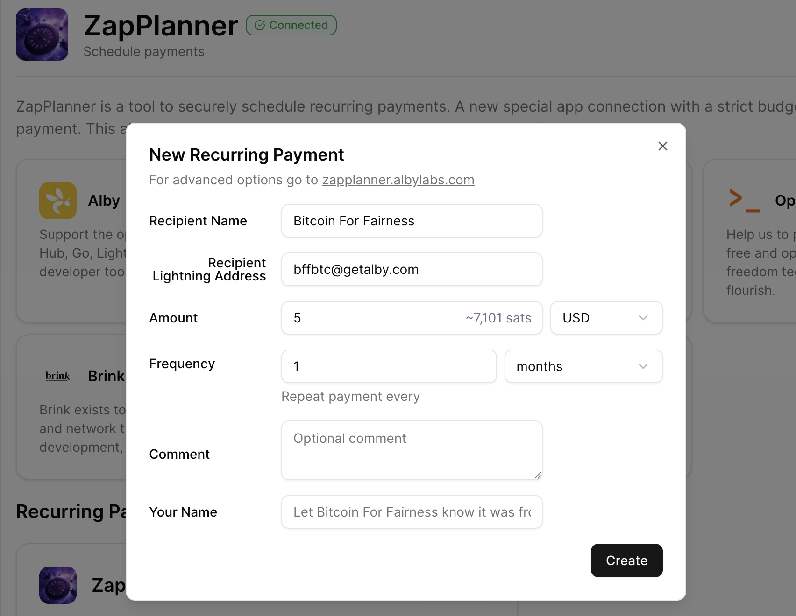

# Recurring Payments with Alby's Self-Custodial Lightning Node

Agency over your money is the core promise of Bitcoin, but sending and receiving payments in daily life requires the right tools - ones that keep you in control without demanding hours of technical setup.

Alby is a service that lets you run your own Lightning Node without the hassles of setting up and administering it on your own device. It's a node in the cloud for those who travel frequently or prefer not to manage their own hardware. It's self-custodial, you own the private keys to your node, meaning even if Alby shuts down operations you will be able to get your money back. It is not fully trustless though as Alby is running the infrastructure and payments are connected to your Alby account. If you are capable of running your own node, you should. Node runners are important for the decentralization and censorship resistance of [Bitcoin](https://my.cracktheorange.com/bitcoin-knowledge/using-bitcoin/) and the [Lightning Network](https://my.cracktheorange.com/bitcoin-knowledge/lightning-network). 

[Alby](https://getalby.com) offers a lot of practical tools like sub-wallets for your family or team, you can pay AI, receive sats on Nostr apps and much more. One feature is ZapPlanner, it allows you to setup recurring payments to a Lightning address. 

## ZapPlanner - a Great Tool for Recurring Donations

Bitcoin for Fairness is one of the non-profits that is listed as a recipient inside ZapPlanner, but you can send to any Lightning address. You define the amount to send and the frequency - done. Now all you need to do is make sure you have enough funds in your channels on your Lightning node.

