# Government Money Is Not Broken. It Works Exactly as Designed. Zimbabwe Proves It.

In September 2022, I photographed a man on a street in Harare carrying a bag full of Zimbabwean dollar banknotes. I assumed he was not carrying more than a couple of US dollars worth of value.

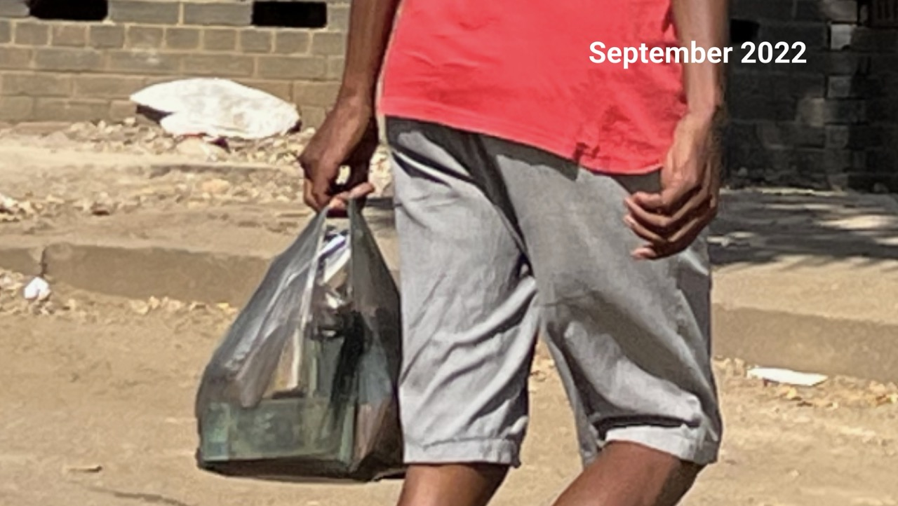
*Source: Anita*

Most of us have heard about hyperinflation in Zimbabwe or Venezuela. When I started learning about Bitcoin in 2017, the argument I kept hearing was: it's scarce, it cannot be inflated by central banks, so it must be the solution for people in these countries. But none of the people making that argument had ever visited these countries to see if it was really working.

My interest in Bitcoin started when I learned how it can elevate people out of exploitative systems. At the same time I had a friend in Zimbabwe who made the decision to visit easier. I wanted to understand how the monetary system was failing and what the reasons were.

I am not an economist. When I discovered Bitcoin I had to learn how national currencies work in general. Growing up in a so-called developed nation with an average of 2% inflation per year, you don't question things. You think this is how it is meant to be. 2% compounds over the years, but the immediate impression is that it's not much and that this is just how the system works. I never questioned it. Most people never do. It took Bitcoin, and time spent in Zimbabwe, to show me how a closed system controlled by the few can be abused: how it depends on the decisions of people who may not have the information or the will to make decisions that benefit everyone.

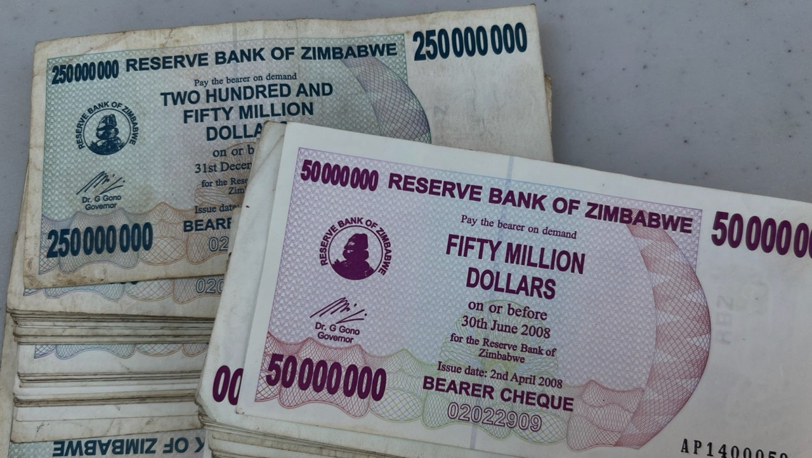
*Source: Anita*

## A Homemade Crisis

I have no proof, but I am 100% sure that Satoshi Nakamoto announced the Bitcoin whitepaper in 2008 fully aware of the Zimbabwean banknotes. While Nakamoto referenced the global financial crisis in the Bitcoin Genesis block, the Zimbabwean financial crisis of 2007 to 2009 was homemade. It started with aggressive land reforms in 2000 that destroyed agricultural productivity and drove many farmers out of the country. In Robert Mugabe's time, money was printed to pay off war veterans, to finance the war in the DRC, to secure mineral wealth for political allies. That led to governmental price controls, which caused supply collapses: producers could not sell their goods for the regulated prices as they did not cover their costs. There was a complete loss of fiscal discipline and central bank independence.

In that sense, Zimbabwe's crisis was different from the global financial crisis, which was caused by recklessness, speculation and the fragility of a system that collapsed like a house of cards. But both crises were made possible by the same underlying structure: a financial system that is intransparent and controlled by a small circle of people.

Zimbabwe is wealthy in minerals: gold, diamonds, rare earths. The standard of living could be much higher for every Zimbabwean, with free access to education, a functioning health system, pensions. Instead, a minority has been extracting value from the country and its people since independence in 1980. It demonstrates how the fiat system, which creates money through the issuance of bank credit backed by no real assets or work, can be abused by those in power.

Critics will say Bitcoin is not backed by real assets either. They are wrong. Bitcoin is backed by computational proof-of-work, and by real investments in electricity and infrastructure.

Closed systems that allow the indefinite creation of monetary units by human decision cannot find the real value of money. It is similar to exchange rate controls in Zimbabwe, where the Reserve Bank decides on the value of a banknote while the street market finds the real rate. Authorities call it the black market rate to make it sound criminal. It was simply the real one.

The price of bitcoin is found globally on many different markets, by bids, offers and trades in real time, 24 hours a day. The trading books are public. The peer-to-peer market, where people exchange bitcoin directly outside of exchanges, finds its rate by agreeing on the current price. This is similar to how the street value of the Zimbabwean dollar was found: by real-time exchanges on an open market.

Only money with a fixed supply, traded on open and transparent networks, can find its true value by sending price signals through open networks.

## On the Ground

When I visited Zimbabwe for the first time in 2020, both the Zimbabwean dollar and the US dollar were used for payments. Some shops had separate tills.

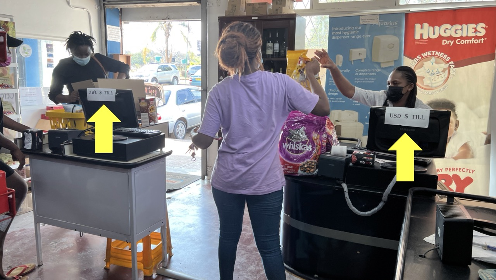
*Source: Anita*

In every shop you had to ask what the current exchange rate was, and based on that you decided whether to pay in ZWD or USD, depending on the rate you had received when you earned the money. Bigger shops had currency boards displaying the current rates.

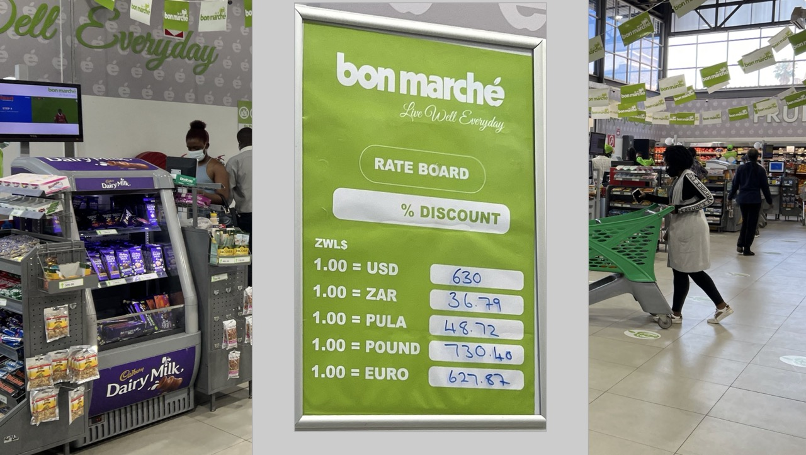
*Source: Anita*

2020 was a dire year. COVID hit and there was a massive fuel shortage in Zimbabwe.

Since no coins exist, you race to find goods that add up to an exact dollar value, otherwise you lose cents with each purchase, or you accept small sweets and chewing gum as change at the counter.

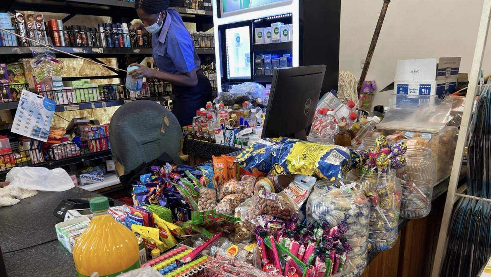
*Source: Anita*

Some shops had started issuing their own store vouchers, which was impractical for customers because the vouchers had expiry dates.

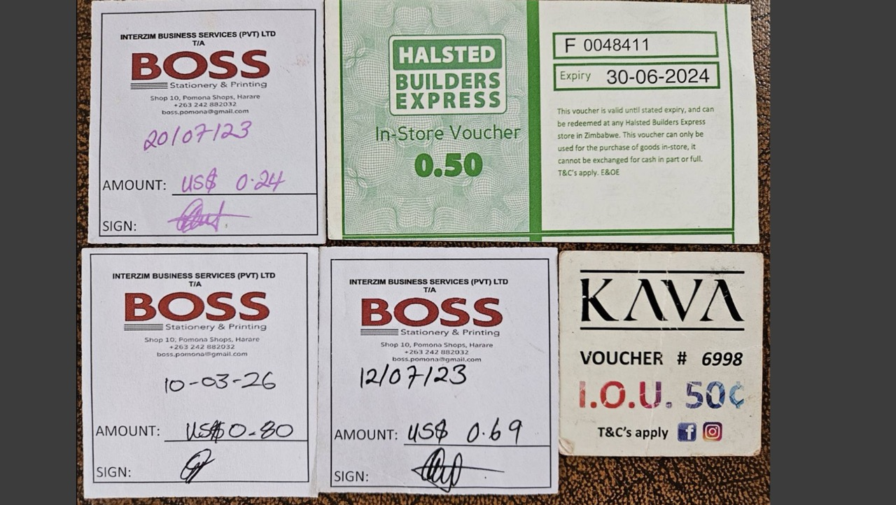
*Source: Francis Miller*

From 2009 to 2019, multiple currencies were legal tender in Zimbabwe: the US dollar, the South African rand, the Botswana pula, as well as the euro and the pound. Prices stabilized. There was even slow economic growth.

In 2015, US dollar banknotes dried up at the banks because Zimbabwe was importing more than it exported, creating a cash liquidity crisis. The Reserve Bank responded by introducing [bond coins in 2014 and bond notes in 2016](https://en.wikipedia.org/wiki/Zimbabwean_dollar_(2019%E2%80%932024)) as a surrogate currency, officially interchangeable at 1:1 with the US dollar. They quickly lost value. The public did not trust them.

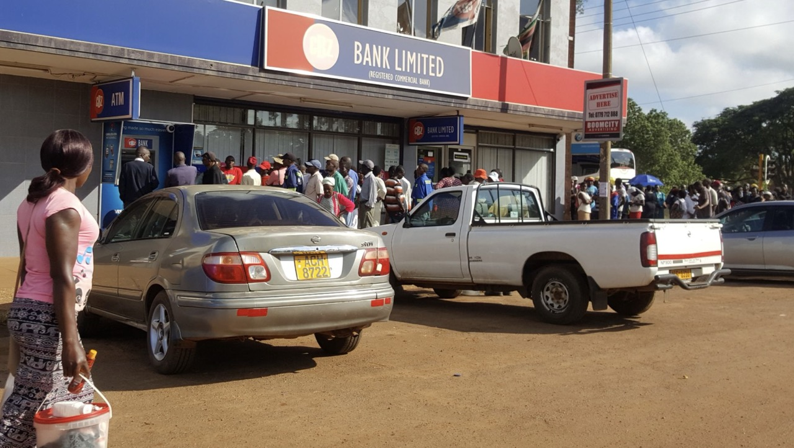
*Source: Anita*

The shortage of cash showed in the quality of the banknotes themselves. The US dollar notes in Zimbabwe are in high demand but never get exchanged for new notes. If you happen to receive a high quality note you try not to spend it. Street vendors will not accept torn ones.

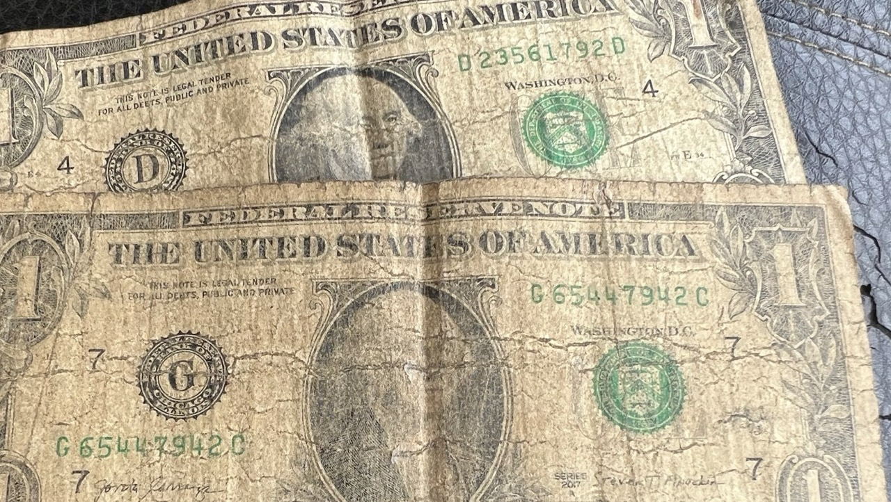
*Source: Anita*

## Stealing in Plain Sight

In February 2019, the Zimbabwean dollar was reintroduced with a promised exchange rate of 1:1 to the US dollar. A friend of mine experienced firsthand what happened. From one day to the next, all US dollars held in Zimbabwean bank accounts were forcibly converted at 1:1 to Zimbabwean dollars. If you had 10,000 USD in the bank, you had 10,000 ZWD the next day. The Reserve Bank promised the rate would hold. Nobody believed it. They were right.

After the hyperinflation of 2007 to 2009, trust in the system was gone. Everyone has been searching for US dollars ever since, to preserve the value of their earnings.

But government employees, the largest share of formal workers in Zimbabwe, are paid in ZWD, not USD. An estimated 95% of people work in the informal sector: selling on the streets, working as housekeepers or gardeners, taking day jobs, or digging for gold in small mines. The average salary for a doctor at a government hospital is 400 USD a month. Most people make far less, while rents and food prices are comparable to Western standards, and all without safety oversight, workers' rights, health insurance or consumer protections.

From the Zimbabweans I spoke with, I learned about a practice of those in power. They enforce ZWD as payment for school fees, have the Reserve Bank print more ZWD, then send runners to rural areas to exchange the worthless ZWD for the USD people had managed to save. An elaborate scheme to steal from the people by giving them worthless paper and extracting US dollars. It's no secret in Zimbabwe how things don't work for the common people, but for those in power.

The devastating effect is that almost any government service can be accelerated with a bribe. Drivers' licenses can be bought. Society runs on corruption and theft. Since there is no attempt at a functioning rule of law and no freedom of speech, people are jailed for the slightest criticism of the government, and individuals across all classes live in permanent survival mode. It shows in the behavior: reckless driving, a run to all kinds of churches and pastors promising a better life, and the sense that your own survival comes before anyone else's.

## The Price of Bread

For those of us who have never experienced hyperinflation, it is hard to imagine. The bread price makes it concrete. A typical Zimbabwean loaf cost 1 USD in 2019. In April 2026, it still costs around 1 USD in dollar terms. In ZWD terms, this is what happened: in 2020 during my first visit, bread was 29 ZWD. In 2021, during COVID when many people lost their income, the exchange rate hit 105. In 2022, when I photographed the man with the bag of banknotes, it was 1 USD to 200 ZWD. By 2023 one loaf cost 4,000 ZWD. At the beginning of 2024 it was 12,000 ZWD, and only three months later 35,000 ZWD.

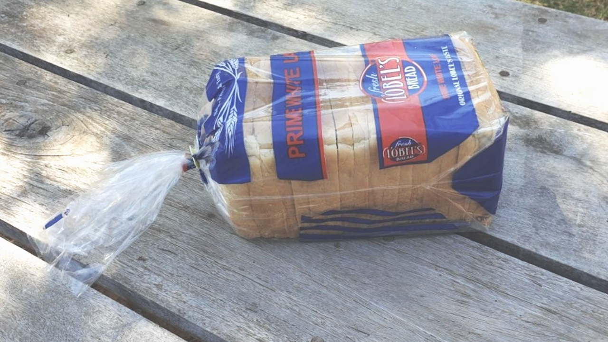
*Source: Anita*

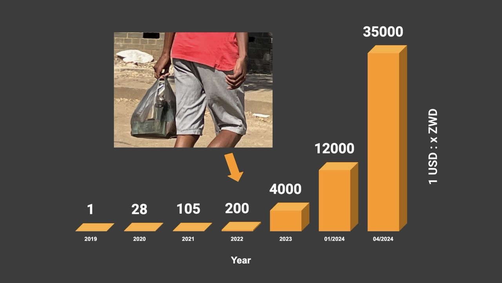
*Source: Anita*

## Another Broken Promise

Then the Reserve Bank introduced a new currency: Zimbabwe Gold, or ZiG, claiming it was backed by real gold. Zimbabweans had been burned too many times. Nobody trusted it. Not even the government.

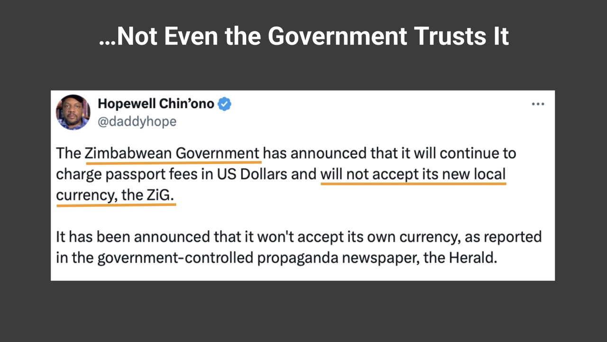
*Source: [Hopewell Chin'ono](https://x.com/daddyhope/status/1790254867304370468?s=20)*

They tried to enforce it anyway, arresting money exchangers and requiring school fees to be paid in ZiG.

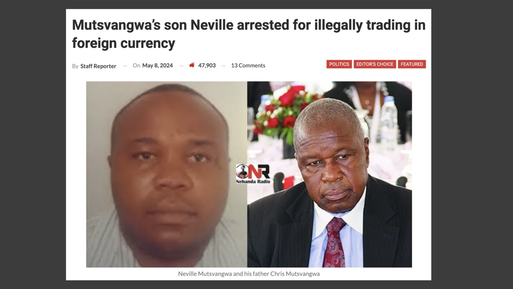
*Source: [Nehanda Radio](https://nehandaradio.com/2024/05/08/mutsvangwas-son-neville-arrested-for-illegally-trading-in-foreign-currency/)*

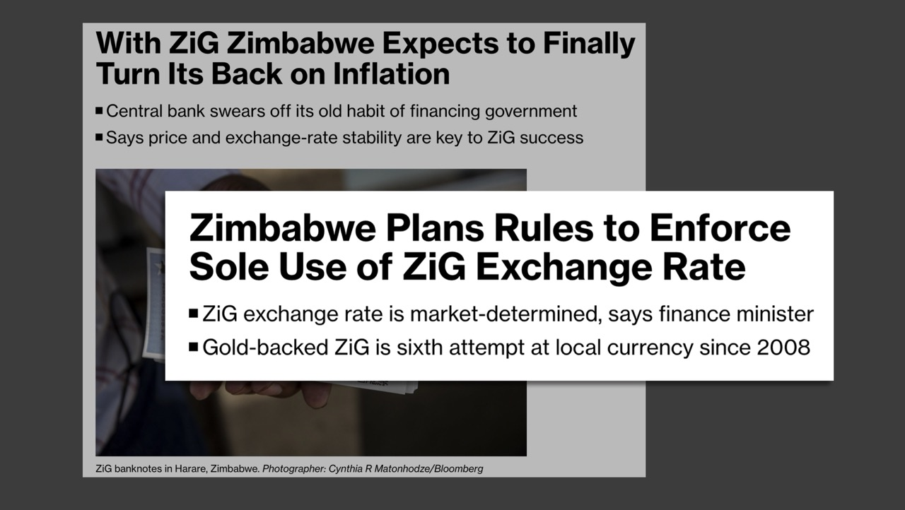
*Source: [Bloomberg](https://www.bloomberg.com/news/newsletters/2024-04-09/next-africa-will-zimbabwe-s-new-zig-currency-retain-value)*

There were no banknotes in circulation. It existed only as mobile money. The official exchange rate was manufactured from the start: 1 USD to 13 ZiG. No explanation was given for that number. No independent audit of the supposed gold backing has ever been conducted. The gold price rose 24% over the same period the ZiG lost value and utility. The gold backing is a story.

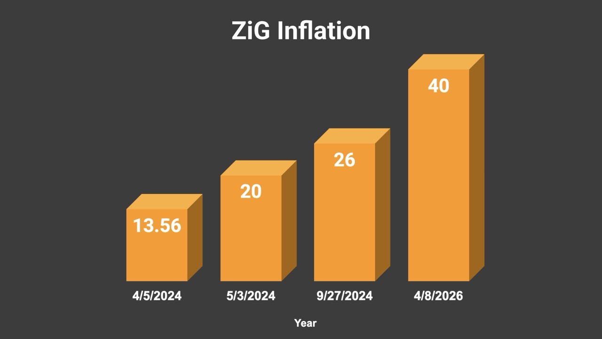
*Source: Anita*

On April 7, 2026, the Reserve Bank [introduced new banknotes](https://www.newsday.co.zw/local-news/article/200053619/undefined) under the name BIG5ZIG. ZiG 10, 20, and 50 notes were released. Higher denominations, ZiG 100 and ZiG 200, were produced but will be "introduced gradually, guided by transactional demand and prevailing monetary conditions." That is a careful way of saying: when the lower denominations have lost enough value to [become useless](https://www.newzimbabwe.com/even-if-you-introduce-zig500-its-useless-citizens-react-to-rollout-of-new-banknotes/).

A couple of days before introducing the new ZiG banknotes the Reserve Bank announced that the use of USD in Zimbabwe is safe, meaning it will not be replaced by the ZiG. In 2019 they made the use of USD unlawful in an attempt to install the Zimbabwean dollar within the population.
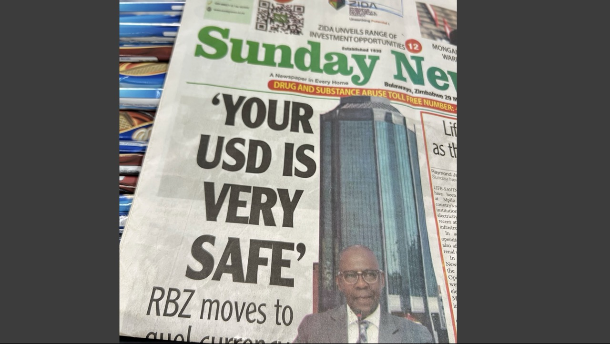
*Source: Anita*

On the day the new notes were introduced, the exchange rate jumped from an artificial 1 USD to 26 ZiG, to 1 to 40. [Zimbabweans have learned their lesson](https://www.myzimbabwe.co.zw/news/186752-zigs-secret-death-warrant-why-the-new-banknotes-are-already-being-rejected-by-the-elite.html). They will not use the ZiG unless forced.

Critics will say Zimbabwe is a special case. In most developed countries, inflation is kept low and controlled. That may be true. But it does not make the system better. The tools are the same: a closed system with privileged access, where those in power decide how much money exists and who benefits. Over time, the loss of value compounds until the currency collapses and a new one is introduced. This has happened in Zimbabwe repeatedly, within living memory, each time with new promises.

Bitcoin does not make promises. It is fair by design. Anyone can use it. No one can inflate the supply. Anyone can audit it, anytime.